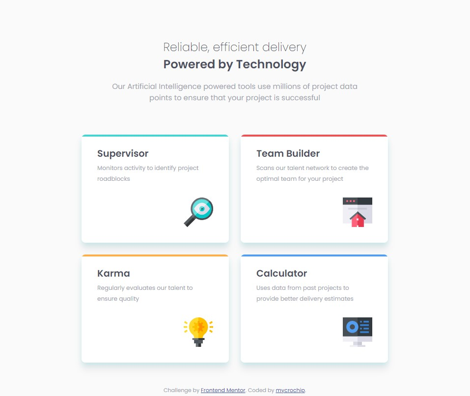
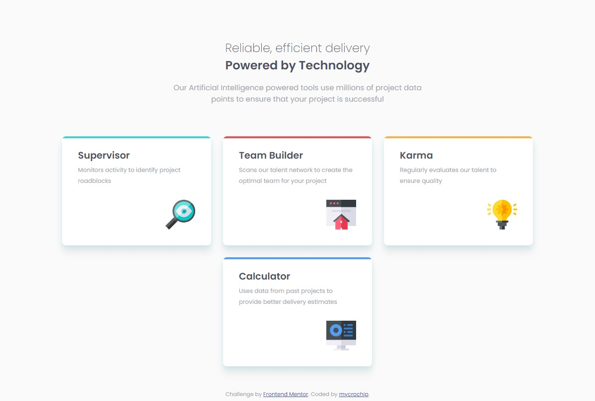
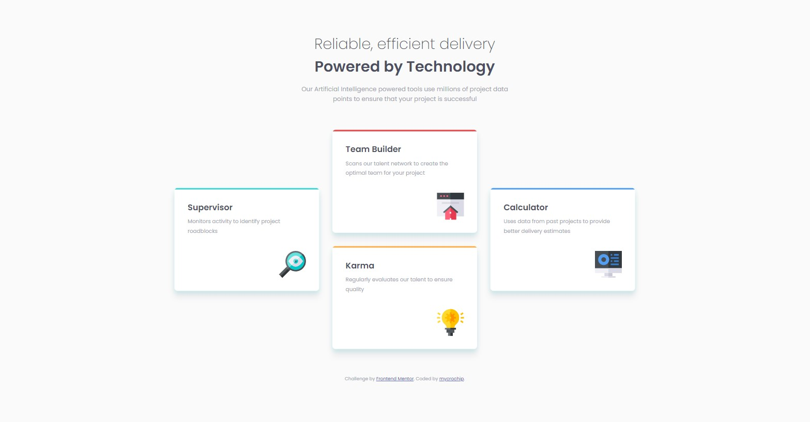

# Frontend Mentor - Four card feature section solution

This is a solution to the [Four card feature section challenge on Frontend Mentor](https://www.frontendmentor.io/challenges/four-card-feature-section-weK1eFYK). Frontend Mentor challenges help you improve your coding skills by building realistic projects. 

## Table of contents

- [Overview](#overview)
  - [The challenge](#the-challenge)
  - [Screenshot](#screenshot)
  - [Links](#links)
- [My process](#my-process)
  - [Built with](#built-with)
  - [What I learned](#what-i-learned)
  - [Continued development](#continued-development)
  - [Useful resources](#useful-resources)
- [Author](#author)


## Overview

### The challenge

Users should be able to:

- View the optimal layout for the site depending on their device's screen size

### Screenshot

#### Mobile


#### Tablet



#### Desktop-Small



#### Desktop-Large




### Links

- Solution URL: [GitHub](https://github.com/mycrochip/four-card-feature-section.git)
- Live Site URL: [GitHub Pages](https://mycrochip.github.io/four-card-feature-section/)


## My process

### Built with

- Semantic HTML5 markup
- CSS custom properties
- Flexbox
- CSS Grid
- Mobile-first workflow


### What I learned

I tried using best HTML and CSS practices by creating and reusing card components using the same classes and only modifying them with a single unique class (card--n).

```html
<section class="card card--1">
  <h2 class="card__header">Supervisor</h2>

  <p class="card__desc">Monitors activity to identify project roadblocks</p>
</section>
```

I also found out that I couldn't use grid-template-areas to make items span intersecting lines as follows; I used the row and column lines instead.

```css
.wrapper {
    display: grid;
    justify-content: center;
    gap: 1rem 2rem;
    /* grid-template-areas: 
                        "0 B 0"
                        "A B D"
                        "A C D"
                        "0 C 0";*/
    grid-template-columns: repeat(3, 350px);
    grid-template-rows: repeat(4, 125px);
}

.card--1 {
    /* grid-area: A; */
    grid-row: 2 / span 2;
    grid-column: 1;
}
```


### Continued development

More projects to be completed on [FrotendEnd Mentor](www.frontendmentor.io)

### Useful resources

- I found [learncssgrid.com](https://learncssgrid.com/#positioning-items-grid-line-numbers) to be a useful resource for me in noticing that a different approach needed to be taken in making items span rows and columns.


## Author

- Frontend Mentor - [@mycrochip](https://www.frontendmentor.io/profile/@mycrochip)
- Twitter - [@mycrochip_world](https://www.twitter.com/@mycrochip_world)